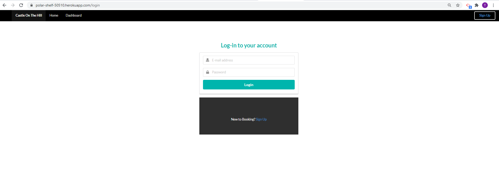

## Castle On The Hill

## Description
Castle On a Hill is the Pham families booking system of our holiday house down on the bayside of Melbourne. The idea came from my family currently having a holiday house that we plan to rent out, but however do not want to use such existing applications like Booking.com, Airbnb or Stayz.

## User Story

As a new Holiday house owner, I would like to rent out my property without having to go through a third-party accommodation booking company so that I may receive 100% profit.

As the Holiday seeker I have come across this holiday house close to Melbourne CBD that I can stay at for a short trip.

## Technology
MongoDB
Express.js
React.js
Node.js
Semantic UI
ReactStrap

## Installation
Clone Respository
Config Server.Js to MongoDB URI (Optional)
Open Terminal/GitBash and cd into the repository
Run npm install
Run npm start

## Screenshots
HomePage

 
Login

 
