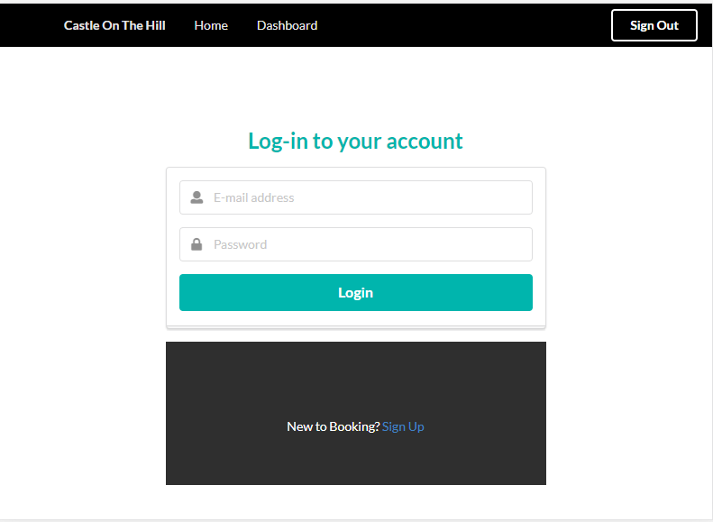

## Castle On The Hill

## Description
Castle On a Hill is the Pham families booking system of our holiday house down on the bayside of Melbourne. The idea came from my family currently having a holiday house that we plan to rent out, but however do not want to use such existing applications like Booking.com, Airbnb or Stayz.

---
| Table of Contents |
|---|
| [User Story](#UserStory) |
| [Technology](#Technology) |
| [Installation](#Installation) |
| [Screenshots](#Screenshots) |
| [Links](#Links) |
| [Questions](#Questions) |
---

## UserStory

As a new Holiday house owner, I would like to rent out my property without having to go through a third-party accommodation booking company so that I may receive 100% profit.

As the Holiday seeker I have come across this holiday house close to Melbourne CBD that I can stay at for a short trip.

## Technology
MongoDB
Express.js
React.js
Node.js
Semantic UI
ReactStrap

## Installation
Clone Respository
Config Server.Js to MongoDB URI (Optional)
Open Terminal/GitBash and cd into the repository
Run npm install
Run npm start

## Screenshots
HomePage: the landing page that will appear when the webpage is visited or deployed

 
Login: Clicking the "Login To Start Booking" will link to the login page

 
Signup: Clicking "Sign Up" on the login page will link you to this page to signup

 
Dashboard: Once logged in successfully you will be pushed here to view previous request bookings and to submit your own request

 

## Links
Github Repository
Github : https://github.com/phamthomas12/CastleOnTheHill/

URL
Deployed : https://polar-shelf-50510.herokuapp.com/dashboard/

## Questions
Please direct questions to the following email: phamthomas12@gmail.com

Github: https://github.com/phamthomas12